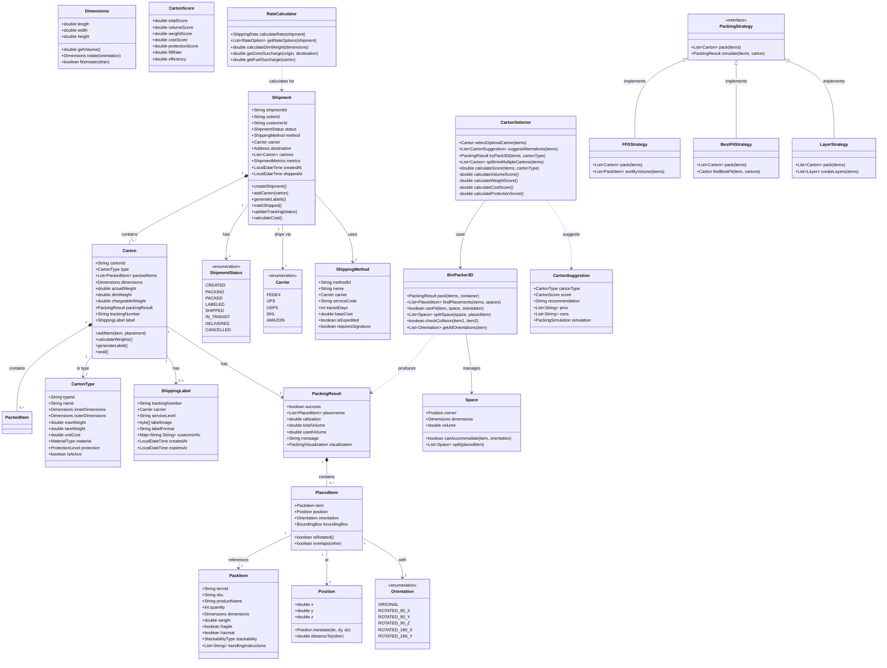
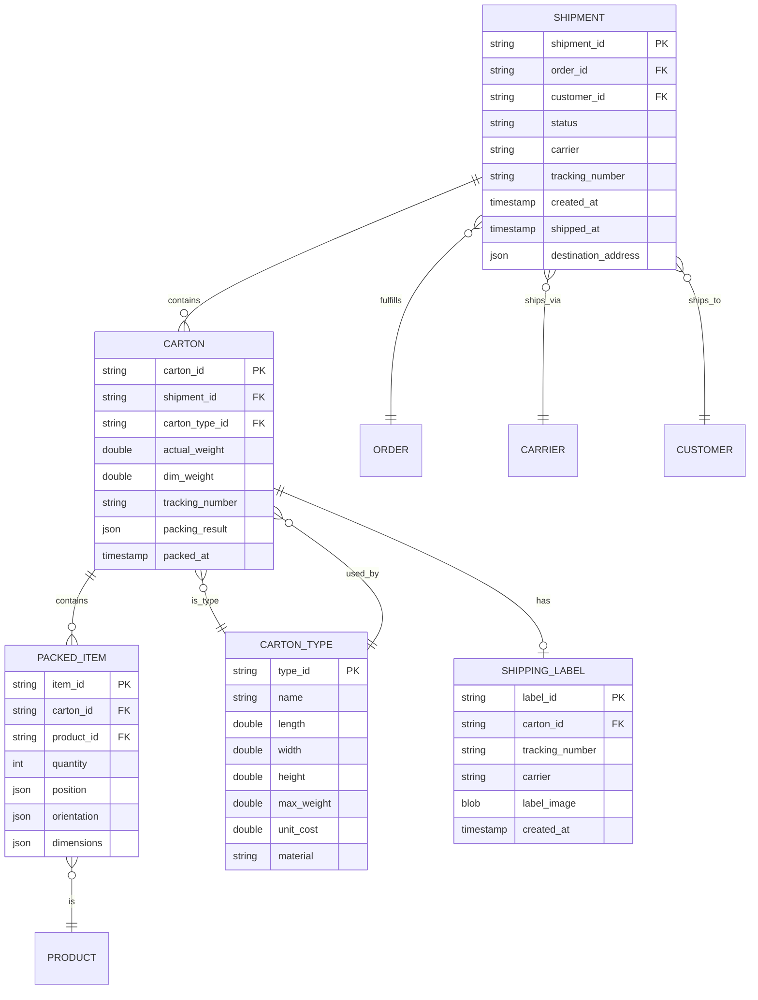
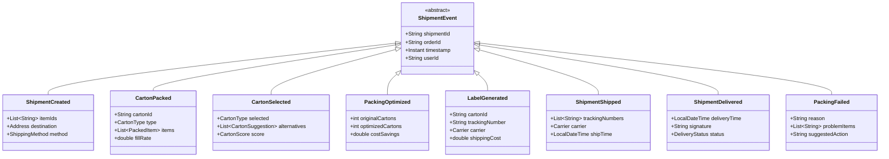

# Pack Ship Service - Domain Model

## Overview

The Pack Ship Service domain model implements sophisticated packing and shipping operations using Domain-Driven Design. The model centers around the Shipment Aggregate with advanced 3D bin packing algorithms and multi-criteria carton selection.

## Class Diagram



## Entity Relationships



## Value Objects

### Dimensions
```java
public class Dimensions {
    private final double length;
    private final double width;
    private final double height;

    public double getVolume() {
        return length * width * height;
    }

    public double getDimensionalWeight(int divisor) {
        return getVolume() / divisor;
    }

    public Dimensions rotate(Orientation orientation) {
        // Return rotated dimensions
    }
}
```

### Position
```java
public class Position {
    private final double x;
    private final double y;
    private final double z;

    public boolean isWithin(BoundingBox box) {
        return x >= box.minX && x <= box.maxX &&
               y >= box.minY && y <= box.maxY &&
               z >= box.minZ && z <= box.maxZ;
    }
}
```

### BoundingBox
```java
public class BoundingBox {
    private final Position minCorner;
    private final Position maxCorner;

    public boolean intersects(BoundingBox other) {
        return !(maxCorner.x < other.minCorner.x ||
                minCorner.x > other.maxCorner.x ||
                maxCorner.y < other.minCorner.y ||
                minCorner.y > other.maxCorner.y ||
                maxCorner.z < other.minCorner.z ||
                minCorner.z > other.maxCorner.z);
    }
}
```

### Address
```java
public class Address {
    private final String street;
    private final String city;
    private final String state;
    private final String zipCode;
    private final String country;
    private final boolean residential;
}
```

## Domain Events



## Domain Services

### CartonSelector
Intelligent carton selection with 3D validation:
- `selectOptimalCarton()` - Find best carton for items
- `suggestAlternatives()` - Provide top 5 options
- `tryPack3D()` - Validate packing with 3D algorithm
- `splitIntoMultipleCartons()` - Handle oversized orders
- `calculateScore()` - Multi-criteria scoring

### BinPacker3D
3D bin packing implementation:
- `pack()` - Execute FFD packing algorithm
- `findPlacements()` - Find valid positions for items
- `canFit()` - Check if item fits in space
- `splitSpace()` - Manage remaining spaces
- `checkCollision()` - Validate no overlaps
- `getAllOrientations()` - Generate 6 rotations

### RateCalculator
Shipping rate calculation:
- `calculateRate()` - Get shipping cost
- `getRateOptions()` - Compare carrier rates
- `calculateDimWeight()` - Dimensional weight
- `getZoneSurcharge()` - Distance-based pricing
- `getFuelSurcharge()` - Current fuel adjustments

### LabelService
Shipping label generation:
- `generateLabel()` - Create carrier label
- `validateAddress()` - Address verification
- `getTracking()` - Tracking number assignment
- `printLabel()` - Format for printing
- `voidLabel()` - Cancel unused labels

## Algorithms

### 3D Bin Packing Algorithm (FFD)
```
1. Sort items by volume (largest first)
2. Initialize empty spaces list with container
3. For each item:
   a. For each orientation (6 total):
      - Find first space that fits
      - If found, place item
      - Split remaining space into 3 sub-spaces
      - Add sub-spaces to spaces list
      - Break to next item
   b. If no fit found, item doesn't fit
4. Calculate utilization metrics
5. Return packing result
```

### Carton Selection Scoring
```
1. For each available carton type:
   a. Try 3D packing simulation
   b. If items fit:
      - Calculate volume score (40%)
      - Calculate weight score (30%)
      - Calculate cost score (20%)
      - Calculate protection score (10%)
      - Total score = weighted sum
2. Sort cartons by total score
3. Return highest scoring carton
```

### Multi-Carton Splitting
```
1. Try single carton first
2. If doesn't fit:
   a. Sort items by priority/fragility
   b. Create first carton with priority items
   c. Fill remaining space optimally
   d. Repeat for remaining items
3. Optimize carton combinations
4. Return list of packed cartons
```

## Business Rules

1. **Carton Selection Rules**
   - Minimum 40% fill rate required
   - Maximum 85% weight capacity
   - Fragile items need protective cartons
   - Hazmat requires special packaging

2. **Packing Rules**
   - Heavy items on bottom
   - Fragile items on top
   - No mixing of incompatible items
   - Respect stacking limits

3. **Shipping Rules**
   - Labels expire after 24 hours
   - International requires customs docs
   - Signature required for high-value
   - Insurance for items >$100

4. **Cost Optimization**
   - Use dimensional weight divisor 166
   - Consider zone skipping
   - Batch similar destinations
   - Rate shop across carriers

## Performance Considerations

- 3D packing uses spatial indexing for O(log n) space searches
- Carton types cached in memory
- Rate calculations cached for 1 hour
- Async label generation for large batches
- MongoDB indexes on shipmentId, orderId, status, carrier