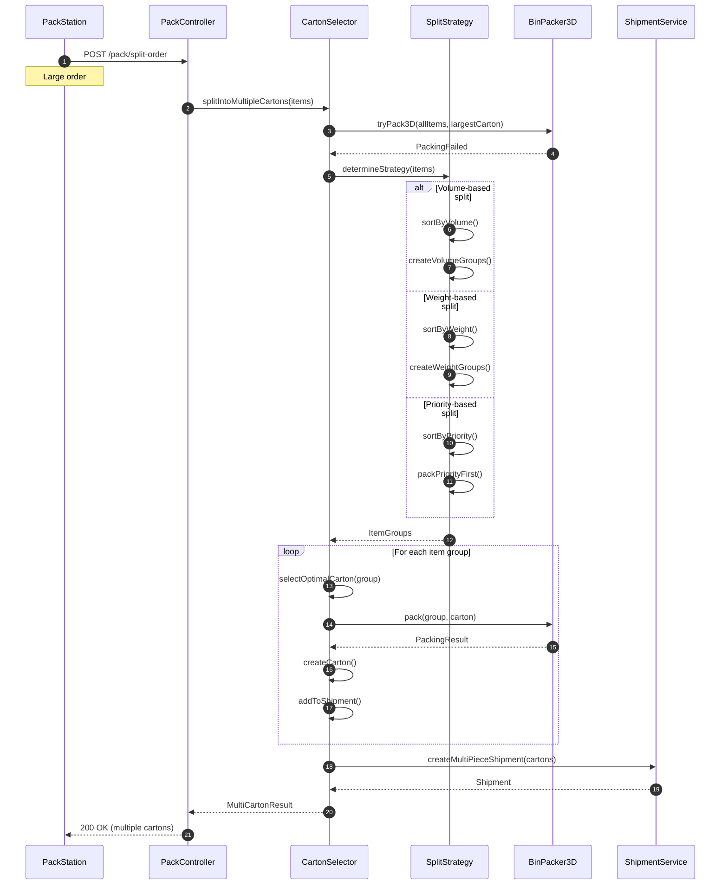
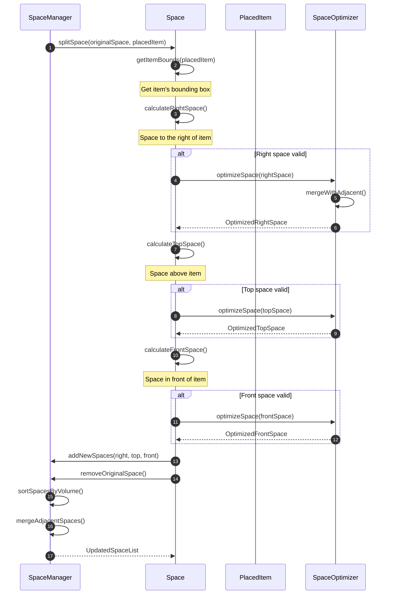
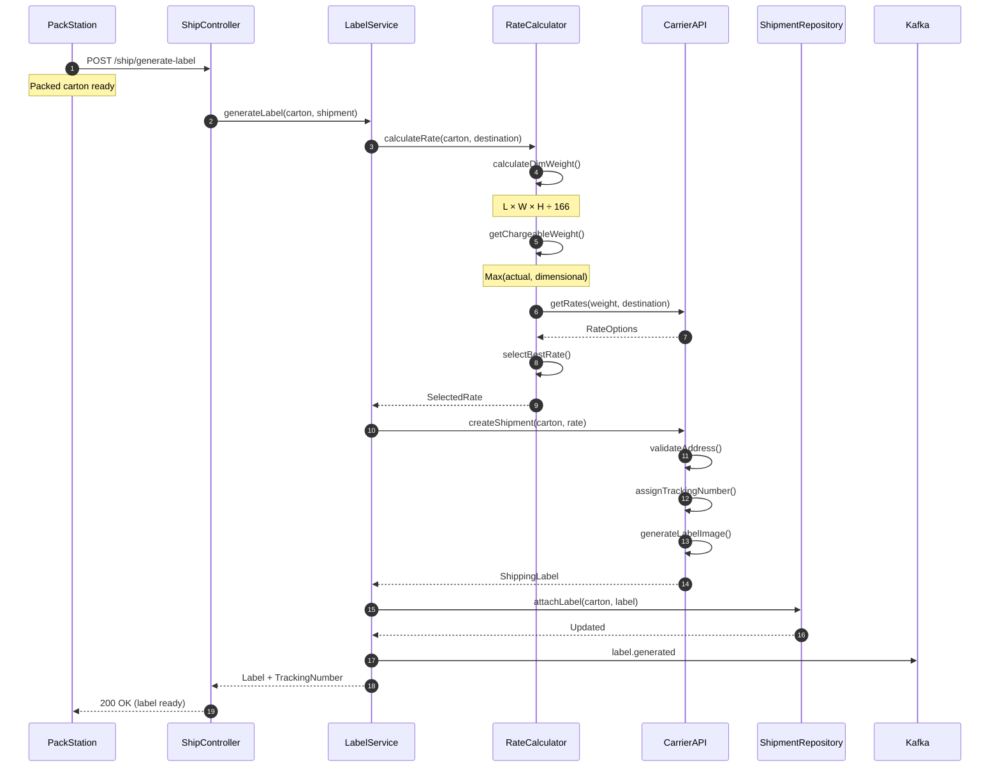
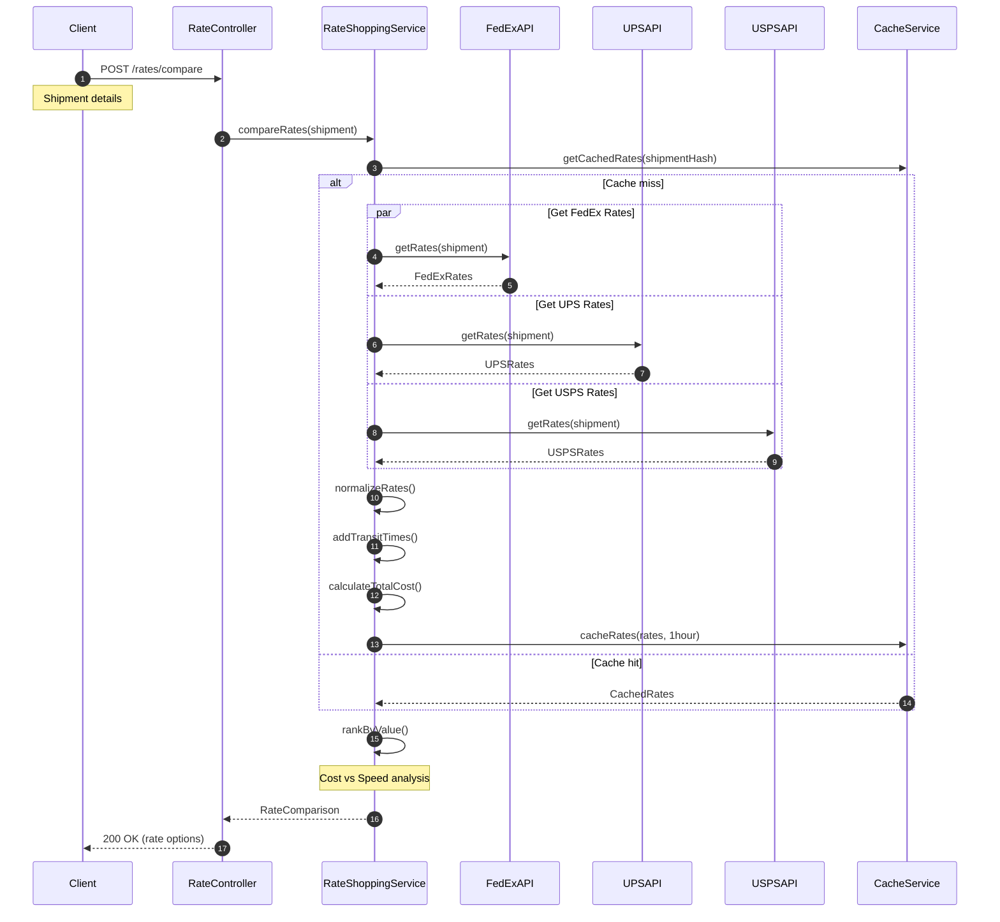
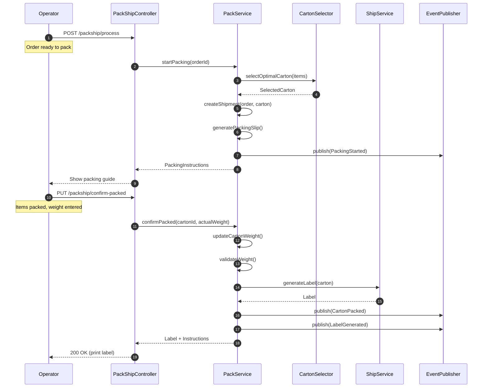
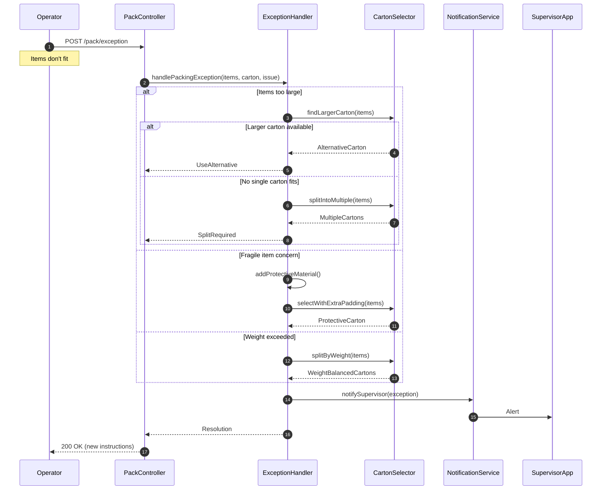
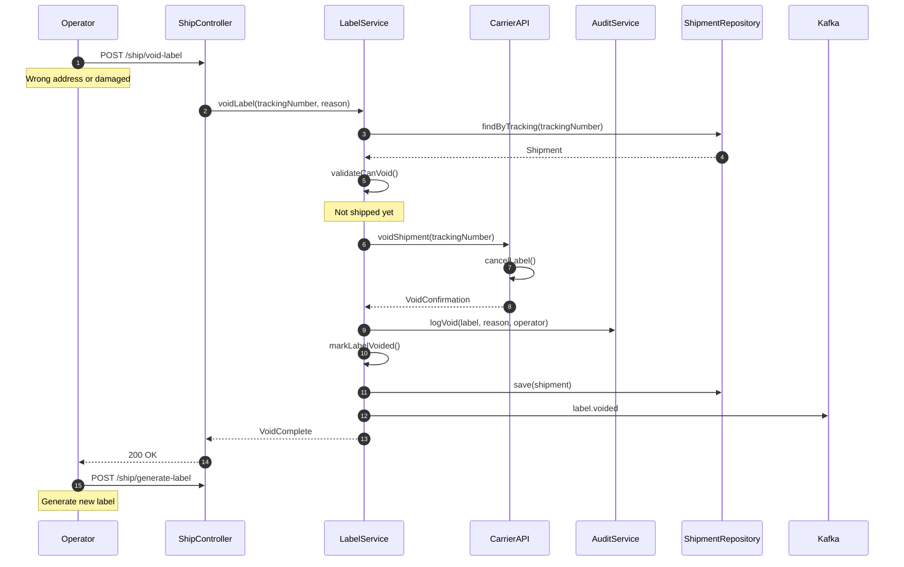
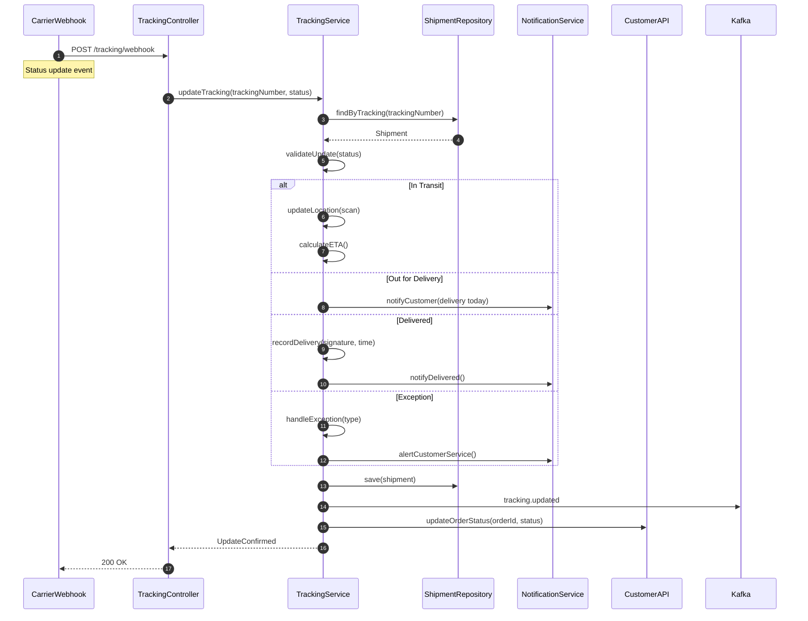
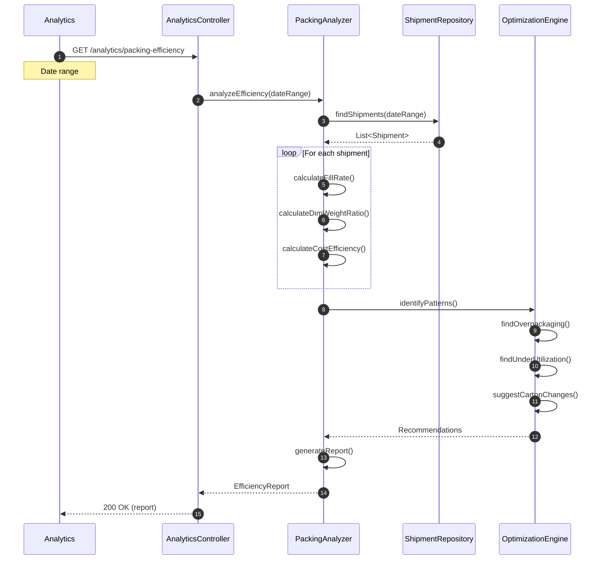
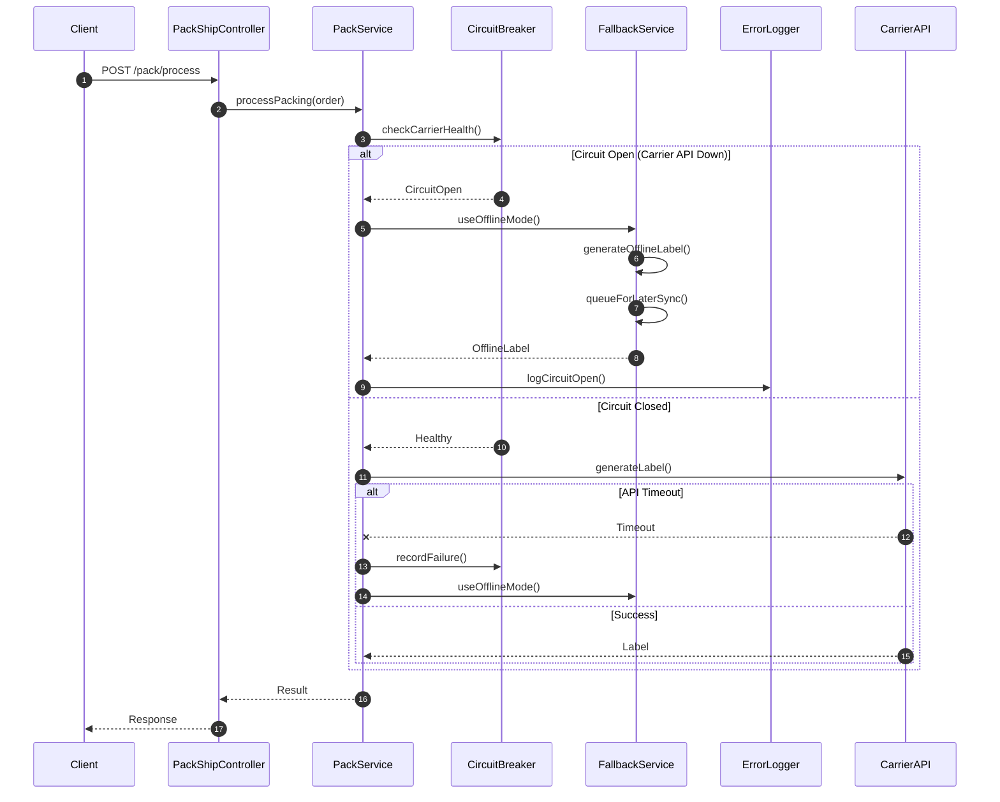

# Pack Ship Service - Sequence Diagrams

## 1. Carton Selection and Packing Flow

### Optimal Carton Selection with 3D Validation

```mermaid
sequenceDiagram
    autonumber
    participant PackStation
    participant PackController
    participant CartonSelector
    participant BinPacker3D
    participant InventoryService
    participant ShipmentRepository

    PackStation->>PackController: POST /pack/select-carton
    Note over PackStation: Order items to pack

    PackController->>CartonSelector: selectOptimalCarton(items)

    CartonSelector->>InventoryService: getItemDimensions(items)
    InventoryService-->>CartonSelector: List<ItemDetails>

    CartonSelector->>CartonSelector: getAvailableCartons()
    CartonSelector->>CartonSelector: filterByWeightCapacity()

    loop For each carton type
        CartonSelector->>BinPacker3D: tryPack3D(items, cartonType)

        BinPacker3D->>BinPacker3D: sortItemsByVolume()
        Note over BinPacker3D: Largest first (FFD)

        BinPacker3D->>BinPacker3D: initializeSpaces()

        loop For each item
            loop For each orientation (6)
                BinPacker3D->>BinPacker3D: findFittingSpace()

                alt Space found
                    BinPacker3D->>BinPacker3D: placeItem()
                    BinPacker3D->>BinPacker3D: splitRemainingSpace()
                    break Item placed
                end
            end
        end

        BinPacker3D->>BinPacker3D: calculateUtilization()
        BinPacker3D-->>CartonSelector: PackingResult

        alt Packing successful
            CartonSelector->>CartonSelector: calculateScore()
            Note over CartonSelector: Volume 40%, Weight 30%, Cost 20%, Protection 10%
        end
    end

    CartonSelector->>CartonSelector: rankByScore()
    CartonSelector->>CartonSelector: selectBest()

    CartonSelector-->>PackController: SelectedCarton + Alternatives
    PackController-->>PackStation: 200 OK (carton recommendation)
```

### Multi-Carton Order Split



## 2. 3D Bin Packing Algorithm Flow

### Detailed 3D Packing Process

```mermaid
sequenceDiagram
    autonumber
    participant Packer
    participant BinPacker3D
    participant SpaceManager
    participant CollisionDetector
    participant Visualizer

    Packer->>BinPacker3D: pack(items, container)

    BinPacker3D->>BinPacker3D: sortItems(FFD)
    Note over BinPacker3D: Sort by volume descending

    BinPacker3D->>SpaceManager: initializeSpace(container)
    SpaceManager->>SpaceManager: createSpace(0,0,0, L,W,H)
    SpaceManager-->>BinPacker3D: AvailableSpaces

    loop For each item
        BinPacker3D->>BinPacker3D: generateOrientations(item)
        Note over BinPacker3D: 6 possible orientations

        loop For each orientation
            loop For each available space
                BinPacker3D->>CollisionDetector: canFit(item, space, orientation)

                CollisionDetector->>CollisionDetector: checkDimensions()
                CollisionDetector->>CollisionDetector: checkWeightLimit()
                CollisionDetector->>CollisionDetector: checkStackability()

                alt Item fits
                    CollisionDetector-->>BinPacker3D: true

                    BinPacker3D->>BinPacker3D: placeItem(item, space, orientation)

                    BinPacker3D->>SpaceManager: splitSpace(space, placedItem)

                    SpaceManager->>SpaceManager: createRightSpace()
                    SpaceManager->>SpaceManager: createTopSpace()
                    SpaceManager->>SpaceManager: createFrontSpace()
                    SpaceManager->>SpaceManager: removeOriginalSpace()

                    SpaceManager-->>BinPacker3D: UpdatedSpaces

                    BinPacker3D->>Visualizer: addPlacement(item, position)

                    break Item placed successfully
                end
            end
        end

        alt Item not placed
            BinPacker3D->>BinPacker3D: markAsUnpacked(item)
        end
    end

    BinPacker3D->>BinPacker3D: calculateMetrics()
    Note over BinPacker3D: Utilization, weight distribution

    BinPacker3D->>Visualizer: generate3DView()
    Visualizer-->>BinPacker3D: PackingVisualization

    BinPacker3D-->>Packer: PackingResult
```

### Space Splitting Algorithm



## 3. Shipping Label Generation

### Generate Shipping Label with Carrier



### Multi-Carrier Rate Shopping



## 4. Pack and Ship Workflow

### Complete Pack-Ship Process



## 5. Exception Handling

### Packing Exception Flow



### Label Void and Regeneration



## 6. Tracking and Delivery Updates

### Shipment Tracking Updates



## 7. Analytics and Optimization

### Packing Efficiency Analysis



## Error Recovery Patterns



## Key Patterns

1. **3D Bin Packing**: FFD algorithm with 6 orientations and space splitting
2. **Multi-Criteria Scoring**: Weighted scoring for carton selection
3. **Rate Shopping**: Parallel carrier API calls with caching
4. **Exception Handling**: Graceful degradation with offline mode
5. **Real-time Tracking**: Webhook-based status updates
6. **Analytics**: Continuous optimization based on historical data
7. **Audit Trail**: Complete logging of all packing decisions