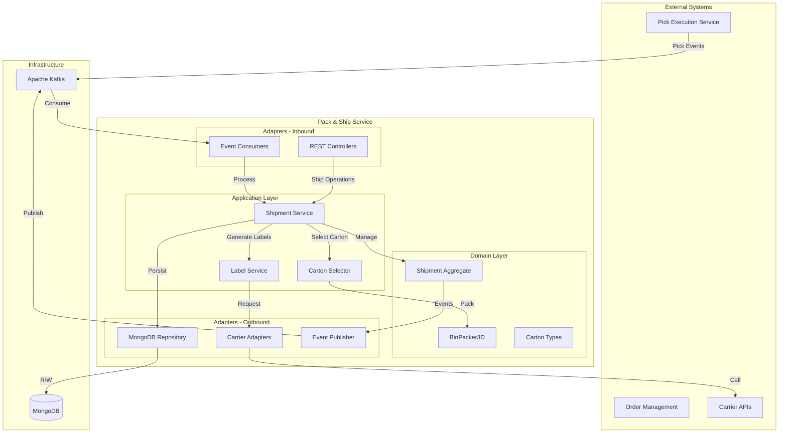

# Pack & Ship Service - Architecture

Comprehensive overview of the Pack & Ship Service architecture with 3D bin packing algorithms and multi-carrier integration.

## High-Level System Architecture



## 3D Bin Packing Algorithm

### Space Partitioning Algorithm

```java
public PackingResult pack(List<PackItem> items, Container container) {
    List<PlacedItem> placements = new ArrayList<>();
    List<Space> availableSpaces = new ArrayList<>();

    // Initialize with full container space
    availableSpaces.add(new Space(
        new Position(0, 0, 0),
        container.getDimensions()
    ));

    // Sort items by volume (largest first)
    items.sort(Comparator.comparingDouble(i -> -i.getVolume()));

    for (PackItem item : items) {
        boolean placed = false;

        for (Space space : availableSpaces) {
            // Try all valid orientations
            for (Orientation orientation : getValidOrientations(item)) {
                if (space.canAccommodate(item, orientation)) {
                    // Place item in space
                    PlacedItem placedItem = new PlacedItem(
                        item, space.getCorner(), orientation
                    );
                    placements.add(placedItem);

                    // Remove used space
                    availableSpaces.remove(space);

                    // Create new spaces from remaining volume
                    List<Space> newSpaces = splitSpace(space, placedItem);
                    availableSpaces.addAll(newSpaces);

                    placed = true;
                    break;
                }
            }
            if (placed) break;
        }

        if (!placed) {
            return new PackingResult(false, placements,
                "Item " + item.getSku() + " does not fit");
        }
    }

    double utilization = calculateUtilization(placements, container);
    return new PackingResult(true, placements, utilization);
}
```

### Space Splitting

When an item is placed, remaining space is split into 3 new spaces:

```java
private List<Space> splitSpace(Space space, PlacedItem item) {
    List<Space> newSpaces = new ArrayList<>();

    Position corner = space.getCorner();
    Dimensions spaceDim = space.getDimensions();
    Dimensions itemDim = item.getDimensions();

    // Space above item
    if (spaceDim.getHeight() > itemDim.getHeight()) {
        newSpaces.add(new Space(
            new Position(corner.getX(), corner.getY(), corner.getZ() + itemDim.getHeight()),
            new Dimensions(itemDim.getLength(), itemDim.getWidth(),
                spaceDim.getHeight() - itemDim.getHeight())
        ));
    }

    // Space to the right
    if (spaceDim.getWidth() > itemDim.getWidth()) {
        newSpaces.add(new Space(
            new Position(corner.getX(), corner.getY() + itemDim.getWidth(), corner.getZ()),
            new Dimensions(itemDim.getLength(), spaceDim.getWidth() - itemDim.getWidth(),
                itemDim.getHeight())
        ));
    }

    // Space behind
    if (spaceDim.getLength() > itemDim.getLength()) {
        newSpaces.add(new Space(
            new Position(corner.getX() + itemDim.getLength(), corner.getY(), corner.getZ()),
            new Dimensions(spaceDim.getLength() - itemDim.getLength(), spaceDim.getWidth(),
                itemDim.getHeight())
        ));
    }

    return newSpaces;
}
```

## Carton Selection Algorithm

### Multi-Criteria Scoring

```java
public CartonSuggestion selectOptimalCarton(List<PackItem> items) {
    List<CartonSuggestion> suggestions = new ArrayList<>();

    for (CartonType cartonType : availableCartonTypes) {
        // Try packing simulation
        PackingResult result = binPacker.pack(items, cartonType);

        if (result.isSuccess()) {
            CartonScore score = calculateScore(items, cartonType, result);
            suggestions.add(new CartonSuggestion(cartonType, score, result));
        }
    }

    // Sort by total score (highest first)
    suggestions.sort(Comparator.comparingDouble(s -> -s.getScore().getTotalScore()));

    return suggestions.isEmpty() ? null : suggestions.get(0);
}

private CartonScore calculateScore(List<PackItem> items, CartonType carton,
                                   PackingResult result) {
    double volumeScore = calculateVolumeScore(result.getUtilization()) * 0.30;
    double weightScore = calculateWeightScore(items, carton) * 0.25;
    double costScore = calculateCostScore(carton) * 0.25;
    double protectionScore = calculateProtectionScore(items, carton) * 0.20;

    return new CartonScore(
        volumeScore + weightScore + costScore + protectionScore,
        volumeScore, weightScore, costScore, protectionScore,
        result.getUtilization()
    );
}
```

### Volume Score Calculation

```java
private double calculateVolumeScore(double utilization) {
    // Optimal utilization: 80-90%
    if (utilization >= 0.80 && utilization <= 0.90) {
        return 100.0;
    } else if (utilization < 0.80) {
        // Penalize low utilization (wasted space)
        return utilization * 125.0; // 60% util = 75 points
    } else {
        // Penalize over-packing
        return Math.max(0, 200.0 - (utilization * 100));
    }
}
```

## Application Services

### Shipment Service
- `createShipment(ShipmentRequest)` - Create shipment
- `packShipment(String shipmentId)` - Pack items into cartons
- `generateLabels(String shipmentId)` - Generate shipping labels
- `markShipped(String shipmentId)` - Dispatch shipment
- `cancelShipment(String shipmentId)` - Cancel shipment

### Carton Selector
- `selectOptimalCarton(List<PackItem>)` - Find best carton
- `suggestAlternatives(List<PackItem>)` - List carton options
- `simulatePacking(List<PackItem>, CartonType)` - Test packing
- `splitIntoMultipleCartons(List<PackItem>)` - Multi-carton strategy

### Label Service
- `generateLabel(Shipment, Carrier)` - Create shipping label
- `validateAddress(Address)` - Verify destination
- `calculateShippingCost(Shipment, Carrier)` - Estimate cost
- `getTrackingInfo(String trackingNumber)` - Track shipment

## Dimensional Weight Calculation

```java
public double calculateDimensionalWeight(Dimensions dimensions, Carrier carrier) {
    double dimFactor = getDimFactor(carrier);
    double dimWeight = (dimensions.getLength() * dimensions.getWidth() *
                       dimensions.getHeight()) / dimFactor;

    return dimWeight;
}

public double getChargeableWeight(double actualWeight, double dimWeight) {
    return Math.max(actualWeight, dimWeight);
}

private double getDimFactor(Carrier carrier) {
    return switch (carrier) {
        case FEDEX, UPS -> 139.0;  // Domestic
        case USPS -> 166.0;
        case DHL -> 139.0;
        case AMAZON -> 139.0;
    };
}
```

## Database Design

### Shipment Collection

```json
{
  "_id": "shipment-12345",
  "orderId": "order-456",
  "customerId": "customer-abc",
  "status": "PACKED",
  "method": "GROUND",
  "carrier": "FEDEX",
  "destination": {
    "street": "123 Main St",
    "city": "New York",
    "state": "NY",
    "zipCode": "10001",
    "country": "USA"
  },
  "cartons": [
    {
      "cartonId": "carton-1",
      "type": {
        "typeId": "MEDIUM_BOX",
        "name": "Medium Box",
        "innerDimensions": {
          "length": 12.0,
          "width": 9.0,
          "height": 6.0
        },
        "maxWeight": 20.0,
        "tareWeight": 0.5
      },
      "packedItems": [
        {
          "item": {...},
          "position": { "x": 0, "y": 0, "z": 0 },
          "orientation": "ORIGINAL"
        }
      ],
      "actualWeight": 8.5,
      "dimWeight": 9.2,
      "chargeableWeight": 9.2,
      "trackingNumber": "1234567890",
      "label": {
        "trackingNumber": "1234567890",
        "carrier": "FEDEX",
        "labelImage": "base64...",
        "createdAt": "2025-10-19T10:00:00Z"
      }
    }
  ],
  "metrics": {
    "totalCartons": 1,
    "totalWeight": 8.5,
    "totalCost": 12.50,
    "averageUtilization": 0.85
  },
  "createdAt": "2025-10-19T09:00:00Z",
  "shippedAt": "2025-10-19T11:00:00Z"
}
```

## Configuration

```yaml
# Packing Configuration
packing:
  min-fill-rate: 0.60
  max-orientations: 6
  allow-multi-carton: true

# Carton Selection
carton:
  selection:
    volume-weight: 0.30
    weight-weight: 0.25
    cost-weight: 0.25
    protection-weight: 0.20

# Carrier Configuration
carrier:
  rate-cache-ttl: 1h
  label-format: ZPL  # ZPL, PDF, PNG
  timeout: 30s
  dim-factors:
    fedex: 139
    ups: 139
    usps: 166
    dhl: 139

# MongoDB
spring:
  data:
    mongodb:
      uri: mongodb://localhost:27017/pack-ship
```

## Performance Optimizations

### Packing Algorithm
- Item pre-sorting by volume (O(n log n))
- Space pruning to remove infeasible spaces
- Early termination on perfect fits
- Orientation caching for identical items

### Caching Strategy
- Carton type specs cached indefinitely
- Carrier rate tables cached (1 hour TTL)
- DIM factors cached
- Label templates cached

### Database Optimization
- Indexes on shipmentId, orderId, status
- Compound index on status + createdAt
- Label images stored as GridFS for large files

## Monitoring Metrics

- Shipment creation rate
- Packing success rate
- Average carton utilization %
- Label generation latency
- Carrier API response time
- Multi-carton percentage
- DIM weight vs. actual weight ratio
